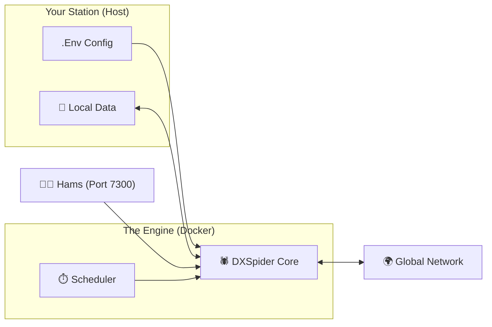

<div align="center">


# 🌐 DXSpider Docker
### The **Ultimate** Modern DX Cluster Solution

[](LICENSE)
[](https://github.com/9M2PJU/9M2PJU-DXSpider-Docker/issues)
[](https://github.com/9M2PJU/9M2PJU-DXSpider-Docker/pulls)
[](https://github.com/9M2PJU/9M2PJU-DXSpider-Docker/commits/main)
<br/>
[](https://github.com/9M2PJU/9M2PJU-DXSpider-Docker/stargazers)
[](https://github.com/9M2PJU/9M2PJU-DXSpider-Docker/network/members)
[](https://github.com/9M2PJU/9M2PJU-DXSpider-Docker/graphs/contributors)
[](https://github.com/9M2PJU/9M2PJU-DXSpider-Docker/commits)
<br/>
[](https://github.com/9M2PJU/9M2PJU-DXSpider-Docker)
[](https://github.com/9M2PJU/9M2PJU-DXSpider-Docker)
[](https://www.perl.org/)
<br/>
[](https://github.com/9M2PJU/9M2PJU-DXSpider-Docker)
[](https://github.com/9M2PJU/9M2PJU-DXSpider-Docker)

<br/>

**Experience the future of Amateur Radio Networking.**
*Deploy a professional-grade DX Cluster node in minutes, not hours.*

[✨ Features](#-key-features) • [🚀 Quick Start](#-quick-start) • [⚙️ Configuration](#-configuration-reference) • [📚 Documentation](#-deep-dive-documentation) • [🆘 FAQ](#-troubleshooting--faq)

</div>

---

## 📖 Introduction

Welcome to **9M2PJU-DXSpider-Docker**. We've taken the legendary DXSpider software—the backbone of the global DX Cluster network—and encased it in a state-of-the-art Docker container.

**Why is this cool?**
*   **Zero Dependencies**: No need to install Perl, CPAN modules, or databases manually.
*   **Sandboxed**: Keeps your server clean and secure.
*   **Portable**: Move your entire cluster to a new server just by copying a few folders.
*   **Beautiful**: Designed for modern sysops who care about quality and ease of use.

> **Standing on Giant Shoulders**: A massive tribute to **Dirk Koopman (G1TLH)**, the creator of DXSpider, for his decades of service to our hobby.

---

## ✨ Key Features

| Feature | Description |
| :--- | :--- |
| **🚀 Instant Launch** | Type 3 lines of code, and you are live. Literally. |
| **🌐 Web Console** | Built-in web terminal for easy administration without SSH. |
| **🔒 Iron-Clad** | Runs with minimal privileges. Hardened for the modern web. |
| **💾 Data Safety** | Your user database and spots are safe in persistent volumes. |
| **🌍 Universal** | Runs on your powerful server OR your customized Raspberry Pi. |
| **🤖 Automation** | Built-in Cron and Startup script support. |
| **⚡ Performance** | Optimized for low-latency spot delivery. |

---

## 🏗 Architecture & Flow

How does the magic happen?


```mermaid
graph LR
    subgraph "Your Station (Host)"
        Config[".Env Config"]
        Data["📂 Local Data"]
    end

    subgraph "The Engine (Docker)"
        DXSpider["🕷️ DXSpider Core"]
        Cron["⏱️ Scheduler"]
    end
    
    World["🌍 Global Network"]
    Users["👨‍💻 Hams (Port 7300)"]

    Config --> DXSpider
    Data <--> DXSpider
    DXSpider <--> World
    Users --> DXSpider
    Cron --> DXSpider
```

---

## 🚀 Quick Start

Follow these simple steps to join the global network.

### Prerequisites
*   Docker & Docker Compose installed.

### 1-Minute Setup

**1. Get the Code**
```bash
git clone https://github.com/9M2PJU/9M2PJU-DXSpider-Docker.git
cd 9M2PJU-DXSpider-Docker
```

**2. Configure Identity**
Open `.env` and tell the cluster who you are.
```bash
nano .env
# Set CLUSTER_CALLSIGN, CLUSTER_SYSOP_CALLSIGN, etc.
```

**3. Launch!**
```bash
docker compose up -d --build
```

🎉 **You are live!** Access your node:
*   **Web Console**: `http://localhost:8080` (Use admin credentials set in `.env`)
*   **Telnet**: `telnet localhost 7300`

---

## 🚀 Multi-Architecture Support

This project supports a wide range of CPU architectures, making it compatible with everything from high-end servers to Raspberry Pi Zero.

**Supported Platforms:**
- `linux/amd64` (Standard 64-bit PC)
- `linux/arm64` (Raspberry Pi 4/5, Apple Silicon, AWS Graviton)
- `linux/arm/v7` (Raspberry Pi 2/3, 32-bit)
- `linux/arm/v6` (Raspberry Pi Zero/1)

### 🐳 Standalone Docker Run
If you prefer not to use Docker Compose, you can run the cluster with a single `docker run` command. This is useful for quick testing or cloud environments like AWS ECS or Azure ACI.

```bash
docker run -d \
  --name dxspider \
  -p 7300:7300 \
  -p 8080:8080 \
  -e CLUSTER_CALLSIGN=9M2PJU-2 \
  -e CLUSTER_SYSOP_CALLSIGN=9M2PJU \
  -v $(pwd)/local_data:/spider/local_data \
  ghcr.io/9m2pju/9m2pju-dxspider-docker:main
```

> [!TIP]
> **Persistent Data**: Always ensure you mount a volume to `/spider/local_data` to keep your user database and spots persistent!

### 🛠️ Manual Multi-Arch Build (Advanced)
> [!NOTE]  
> This is **optional**. Our GitHub Actions automatically build and push these images for you. Use this only if you want to build a custom version locally.

To build for all platforms manually using Docker Buildx:

```bash
docker buildx build --platform linux/amd64,linux/arm64,linux/arm/v7,linux/arm/v6 -t ghcr.io/9m2pju/9m2pju-dxspider-docker:latest --push .
```


---

## ⚙️ Configuration Reference

Edit these in your `.env` file. We've set sensible defaults for everything else.

| Variable | Description | Example |
| :--- | :--- | :--- |
| `CLUSTER_CALLSIGN` | **Required**. The callsign of your node. | `9M2PJU-2` |
| `CLUSTER_SYSOP_CALLSIGN` | **Required**. Your admin callsign. | `9M2PJU` |
| `CLUSTER_LOCATOR` | Your Grid Square. | `OJ03` |
| `CLUSTER_LATITUDE` | Your Latitude. | `+03 08` |
| `CLUSTER_LONGITUDE` | Your Longitude. | `+101 41` |
| `CLUSTER_PORT` | The user-facing Telnet port. | `7300` |
| `CLUSTER_SYSOP_PORT` | The Web Console port. | `8080` |
| `OVERWRITE_CONFIG` | Set to `yes` to force-regenerate DXVars.pm. | `no` |
| `WEB_USER` | Username for the Web Console. | `sysop` |
| `WEB_PASS` | Password for the Web Console. | `supersecret` |
| `CLUSTER_DBUSER` | Username for the MariaDB database. | `sysop` |
| `CLUSTER_DBPASS` | Password for the MariaDB database. | `password` |

---

## 📚 Deep Dive Documentation

<details>
<summary><b>📂 Understanding the Directory Structure</b> (Click to Expand)</summary>

We map several folders from your host machine into the container using Docker Volumes. This is what allows your data to SURVIVE when you update or restart the container.

*   `./local_data`: **CRITICAL**. Stores `users.v3j` (database), spots, debug logs, and state. **Back this folder up regularly!**
*   `./connect`: Scripts that tell your node how to connect to other nodes.
*   `./cmd`: Custom commands you create for your users.
*   `./msg`: Stores bulletins and private messages.
*   `./local_cmd`: System-level local command overrides.
*   `./startup`: Files executed once when the container starts.
*   `./crontab`: Scheduled tasks.

</details>

<details>
<summary><b>🔗 How to Add Partner Nodes</b> (Click to Expand)</summary>

Connecting to the global DX Cluster network is a social and technical process. Follow these steps to link your node:

> [!IMPORTANT]
> **Ask Before You Link**: You cannot simply "connect" to any node. You MUST contact the Sysop of the partner node (e.g., via email or DX message) to ask for a "partner link." They need to configure their cluster to accept your connection while you configure yours to dial them.

1.  **Coordinate with a Sysop**: Find a nearby or reliable node and request an inter-node link.
2.  **Use a Password**: **Highly Recommended.** Always agree on a connection password with your partner. This prevents unauthorized users from spoofing your node and protects the network from spam.
3.  **Create a Connection Script**: Create a file in `connect/` named after the target node (lowercase).
    *   Example: `connect/gb7mbc`
4.  **Add the Connection Logic**:
    ```bash
    timeout 60
    # connect telnet <hostname> <port>
    connect telnet gb7mbc.spud.org 7300
    client gb7mbc telnet
    # Interaction (Wait for 'login', send 'user')
    login gb7mbc
    pass mysecurepassword  # agreed upon with the partner sysop
    ```
5.  **Test it**: Run from the host shell: `docker compose exec dxspider sh -c '/spider/perl/connect gb7mbc'`

</details>

<details>
<summary><b>⏱️ Automation (Cron & Startup)</b> (Click to Expand)</summary>

**Startup Tasks**
Edit the `startup` file. Commands here run every time the container boots.
```bash
# Example 'startup' file content:
load/forward
set/spider gb7mbc
connect gb7mbc
```

**Scheduled Tasks (Cron)**
Edit the `crontab` file. The format is standard Min/Hour/Day/Month/DayOfWeek.
```bash
# Example 'crontab' file content:
# Check connection to GB7MBC every 10 mins
0,10,20,30,40,50 * * * * start_connect('gb7mbc') unless connected('gb7mbc')
```

</details>

---

## ☁️ Cloud Deployment

DXSpider Docker is built to run anywhere. Here is how to deploy it to major cloud providers.

### 🟠 AWS (Amazon Web Services)
**Recommended: EC2 with Docker Compose**
1.  Launch an **EC2 Instance** (t3.micro or t4g.small for ARM64).
2.  Install Docker and Docker Compose.
3.  Clone this repo and follow the [Quick Start](#-quick-start).
4.  **Security Group**: Open ports `7300` (Telnet) and `8080` (Web) to your desired IP ranges.

**Advanced: ECS Fargate**
- Use our sample task definition: [ecs-task-def.json](deploy/ecs-task-def.json).
- Mount an **EFS (Elastic File System)** volume to `/spider/local_data` for persistent storage.

### 🔵 Google Cloud Platform (GCP)
**Recommended: Compute Engine**
1.  Create a VM instance (e2-micro is sufficient).
2.  Use **Container-Optimized OS (COS)** or standard Ubuntu with Docker.
3.  Deploy via Docker Compose.

**Alternative: Cloud Run (Web Console Only)**
- If you only need the **Web Console**, you can deploy directly to Cloud Run using our template: [cloud-run.yaml](deploy/cloud-run.yaml).
- *Note: Cloud Run is serverless and works best for stateless web traffic; use with Cloud SQL or persistent disks for full functionality.*

### 💾 Persistent Storage in the Cloud
When running in the cloud, **never** store your data inside the container or on a temporary local disk.
- **AWS**: Use **EFS**.
- **GCP**: Use **Filestore** or **Persistent Disks**.
- **Azure**: Use **Azure Files**.

### 🟦 Microsoft Azure
**Best for: Mission-Critical Enterprise Hosting**

Azure Container Instances (ACI) provide a great environment for DXSpider.

1.  **Azure Portal**: Go to "Container Instances" -> Create.
2.  **CLI (Quick Start)**:
    ```bash
    az container create \
      --resource-group myResourceGroup \
      --name dxspider-cluster \
      --image ghcr.io/9m2pju/9m2pju-dxspider-docker:main \
      --dns-name-label myclustersite \
      --ports 7300 8080 \
      --azure-file-volume-account-name myStorageAccount \
      --azure-file-volume-account-key myStorageKey \
      --azure-file-volume-share-name dxspider-data \
      --azure-file-volume-mount-path /spider/local_data
    ```
3.  **Template**: Use our [Azure ACI Template](deploy/azure-aci.json) for automated deployment.
4.  **Storage**: Use **Azure Files** for `local_data` to ensure persistence across container restarts.

---

## 🖥️ Virtualization (On-Premises)

If you are running your own home lab or data center, DXSpider Docker works perfectly on major hypervisors.

### 🟣 VMware (ESXi / Workstation / Fusion)
**Best Practice: Linux VM**
1.  Create a Virtual Machine running **Ubuntu Server** or **Debian**.
2.  Enable **Hardware Virtualization** in the VM settings (for better performance).
3.  Install Docker and follow the [Quick Start](#-quick-start).
4.  **Network**: Use "Bridged" networking if you want your DX Cluster to have its own dedicated IP address on your LAN.

### 🟠 Proxmox VE
**Method A: Linux VM (Recommended)**
- Create a standard VM and install Docker. This is the most stable and isolated method.

**Method B: LXC Container (Advanced)**
You can run Docker inside LXC, but it requires specific settings:
1.  Check **"nesting"** and **"keyctl"** in the Container Features.
2.  Ensure the container is **unprivileged** for better security (though privileged may be needed for some advanced networking).
3.  Mount your data volumes from the Proxmox host to keep cluster data persistent even if the LXC is deleted.

### 🌐 Networking Tips for Virt/Cloud
- **Port Forwarding**: Ensure your router/firewall forwards port `7300` (TCP) to your VM/Container's IP.
- **Failover**: If running on Proxmox/VMware clusters, HA (High Availability) will work out-of-the-box since all state is stored in the mapped volumes.

---

## 🪟 Windows Support

Windows users can run DXSpider Docker easily using WSL2 or traditional virtualization.

### 🐳 WSL2 (Recommended)
This is the fastest and most efficient way to run Docker on Windows.
1.  Install **Docker Desktop** and enable the **WSL2 Backend**.
2.  Install a Linux distribution (e.g., Ubuntu) from the Microsoft Store.
3.  **Performance Tip**: Clone this repository *inside* the WSL2 file system (e.g., `~/dxspider`) rather than on the Windows C: drive (`/mnt/c/`). This significantly speeds up disk operations.
4.  Follow the [Quick Start](#-quick-start) from within your WSL2 terminal.

### 💻 Hyper-V
If you prefer not to use Docker Desktop:
1.  Enable the **Hyper-V** feature in Windows.
2.  Create a Linux Virtual Machine.
3.  Install Docker and follow the standard Linux instructions.

### 📁 Windows Path Note
When using `.env` or Volume mappings on Windows, use forward slashes `/` or escaped backslashes `\\` to avoid path resolution errors.

---

## 🆘 Troubleshooting & FAQ

<details>
<summary><b>My container keeps restarting!</b></summary>

Check the logs immediately:
```bash
docker compose logs -f
```
Common issues:
*   Invalid characters in `.env`.
*   Port 7300 is already in use by another application.
</details>

<details>
<summary><b>How do I access the internal shell?</b></summary>

If you need to run manual spider commands or debug internally:
```bash
docker compose exec dxspider sh
# Then run commands like:
/spider/perl/console.pl
```
</details>

<details>
<summary><b>How do I update to the latest version?</b></summary>

Simple. We built this to be easy.
```bash
git pull                   # Get latest docker configs
docker compose down        # Stop old container
docker compose up -d --build # Build new one
```
*Your data in `local_data` will remain safe.*
</details>

---

## 🏛️ History & Legacy

To understand why this project exists, we must look back at the rich history of Amateur Radio networking.

### The Dawn: Packet Clusters
In the late 1980s, **Dick Newell (AK1A)** revolutionized DX hunting by creating the **PacketCluster** software. Before this, DX spots could only be shared via voice repeaters or local shouting. AK1A's software allowed spots to be distributed over **Packet Radio (AX.25)** networks. A "Sysop" would run a node, and users would connect via radio to see a live stream of DX spots.

### The Evolution: DXSpider
By the late 1990s, the internet was emerging, and the original DOS-based AK1A software was showing its age. **Dirk Koopman (G1TLH)** saw the need for a more flexible, modern solution that could bridge the gap between RF networks and the Internet.

He chose **Perl** for its robust text handling and modularity, creating **DXSpider**. It was designed to be:
*   **Compatible**: It spoke the exact same protocol as AK1A, so users didn't need to change their client software.
*   **Scalable**: It could handle hundreds of simultaneous internet connections, something the old PC-based clusters couldn't dream of.
*   **Open**: It allowed the community to contribute and extend the software.

Today, DXSpider powers a vast majority of the world's DX Cluster nodes, silently processing millions of spots a year and keeping the global amateur radio community connected. **9M2PJU-DXSpider-Docker** is simply the next step in this evolution—packaging this history into a container for the future.

---

## 🤝 Contributing

We love community involvement!
1.  Fork it.
2.  Create your feature branch (`git checkout -b feature/cool-thing`).
3.  Commit your changes.
4.  Push to the branch.
5.  Create a Pull Request.

---

## 📜 License

Distributed under the GNU General Public License v3.0. See `LICENSE` for more information.

---

<div align="center">

**Enjoying the project?**
[⭐ Star us on GitHub!](https://github.com/9M2PJU/9M2PJU-DXSpider-Docker)

<br/>

## ☕ Support
 
If you find this plugin useful, you can support its development by buying me a coffee:
 
[](https://buymeacoffee.com/9m2pju)

*Designed with ❤️ by **9M2PJU***
*73 and Good DX!*

</div>
