<div align="center">


<br/>

# 🌐 DXSpider Docker
### The Modern Standard for DX Clustering


[](https://github.com/9M2PJU/9M2PJU-DXSpider-Docker/releases)
[](LICENSE)
[](https://github.com/9M2PJU/9M2PJU-DXSpider-Docker)

<br/>

**Revolutionizing Amateur Radio DX Clustering with Containerization**

[Features](#-key-features) • [Quick Start](#-quick-start) • [Configuration](#%EF%B8%8F-configuration) • [Architecture](#-architecture) • [Contributing](#-contributing)

</div>

---

## 📖 Introduction

**9M2PJU-DXSpider-Docker** brings the legendary **DXSpider** cluster software into the modern era. By encapsulating the complex Perl-based infrastructure into a lightweight, secure, and production-ready Docker container, we empower amateur radio operators to deploy global DX nodes in minutes, not hours.

Whether you are running a contest station, a club node, or backing up the global cluster network, this solution provides the reliability and ease of management you need.

> **Special Acknowledgment**: Deepest gratitude to **Dirk Koopman (G1TLH)** for creating DXSpider, the engine that powers our global DX networks.

---

## ✨ Key Features

- **🚀 Instant Deployment**: Go from zero to a fully functional DX Cluster node in under 2 minutes.
- **🔒 Hardened Security**: Minimal base image with reduced attack surface and non-root execution where possible.
- **💾 Persistent Data**: Smart volume management ensures your user database, spots, and configuration survive restarts.
- **🌍 Multi-Architecture**: Native support for **AMD64** (Standard Server) and **ARM64** (Raspberry Pi / Apple Silicon).
- **🔧 GitOps Ready**: Fully configurable via environment variables and standard config files.
- **🚦 Health Checks**: Built-in Docker health checks for automated recovery and monitoring.

---

## 🏗 Architecture

The following diagram illustrates how the container interacts with the host system, the amateur radio network, and your users.

```mermaid
graph TD
    subgraph "Host System"
        direction TB
        Config[".env Configuration"]
        Volumes["Persistent Volumes (/spider/...)"]
    end

    subgraph "Docker Container"
        DXSpider["🕷️ DXSpider Process"]
        Cron["⏱️ Cron Scheduler"]
        DB["🗃️ Local Data"]
    end

    UserClients["User Clients"] -- Port 7300 --> DXSpider
    Sysop -- Port 7300 --> DXSpider
    DXSpider -- Internet --> GlobalCluster["🌐 Global DX Cluster Network"]
    
    Config --> DXSpider
    Volumes <--> DB
    Volumes <--> DXSpider
```



---

## 🚀 Quick Start

### Prerequisites
- Docker Engine 20.10+
- Docker Compose v2.0+

### 1-Minute Setup

```bash
# 1. Clone the repository
git clone https://github.com/9M2PJU/9M2PJU-DXSpider-Docker.git
cd 9M2PJU-DXSpider-Docker

# 2. Configure your station
cp .env.example .env  # If example exists, otherwise edit .env directly
nano .env

# 3. Start the node
docker compose up -d --build
```

**That's it!** Your node is now running on port `7300`. Connect with any telnet client:
`telnet localhost 7300`

---

## ⚙️ Configuration

Control your node completely via environment variables in `.env`.

### Node Identity
| Variable | Description | Default |
|----------|-------------|---------|
| `CLUSTER_CALLSIGN` | The callsign of your update (Root Node) | `9M2PJU-10` |
| `CLUSTER_SYSOP_CALLSIGN` | Your personal callsign (Admin) | `9M2PJU` |
| `CLUSTER_LOCATOR` | Your Maidenhead Grid Square | `OJ03` |
| `CLUSTER_QTH` | Human-readable location | `Kuala Lumpur` |

### System & Network
| Variable | Description | Default |
|----------|-------------|---------|
| `CLUSTER_PORT` | Public Telnet Port | `7300` |
| `CLUSTER_SYSOP_PORT` | Sysop Management Port | `7300` |
| `CLUSTER_LATITUDE` | Latitude (Decimal) | `+03 08` |
| `CLUSTER_LONGITUDE` | Longitude (Decimal) | `+101 41` |

### Advanced / Database
| Variable | Description | Default |
|----------|-------------|---------|
| `CLUSTER_DB_USER` | Internal Database User | `dxspider` |
| `CLUSTER_DB_NAME` | Database Name | `dxspider` |
| `CLUSTER_DB_HOSTNAME` | Database Host (if external) | `db` |
| `SPIDER_VERSION` | Git Branch/Tag to build | `mojo` |

---

## 💾 Volume Management

We map critical directories to the host to ensure data persistence.

| Host Path | Container Path | Purpose |
|-----------|----------------|---------|
| `./local_data` | `/spider/local_data` | User database, spots, and state. **Backup this!** |
| `./connect` | `/spider/connect` | Partner node connection scripts. |
| `./cmd` | `/spider/cmd` | Custom commands and aliases. |
| `./msg` | `/spider/msg` | Bulletins and messages. |
| `./startup` | `/spider/scripts/startup` | Commands to run on boot. |

---

## 🛠️ Advanced Usage

### Connecting to Partner Nodes
Create a connection script in the `connect` directory.
```bash
# Example: connect/gb7mbc
timeout 60
connect telnet GB7MBC dest_port
client gb7mbc telnet
login gb7mbc
pass your_password
```

### Viewing Logs
```bash
docker compose logs -f dxspider
```

### Accessing the Shell
```bash
docker compose exec dxspider bash
```

---

## 🤝 Contributing

Contributions are what make the open-source radio community great.
1. Fork the Project
2. Create your Feature Branch (`git checkout -b feature/AmazingFeature`)
3. Commit your Changes (`git commit -m 'Add some AmazingFeature'`)
4. Push to the Branch (`git push origin feature/AmazingFeature`)
5. Open a Pull Request

---

## 📜 License

Distributed under the MIT License. See `LICENSE` for more information.

<br/>

<div align="center">
  <p>Made with ❤️ by <b>9M2PJU</b></p>
  <p><i>73 and Good DX!</i></p>
</div>
