# 🌐 DXSpider Docker
### The **Ultimate** Modern DX Cluster Solution

[](LICENSE)
[](https://github.com/9M2PJU/9M2PJU-DXSpider-Docker/issues)
[](https://github.com/9M2PJU/9M2PJU-DXSpider-Docker/pulls)
[](https://github.com/9M2PJU/9M2PJU-DXSpider-Docker/commits/main)
<br/>
[](https://github.com/9M2PJU/9M2PJU-DXSpider-Docker/stargazers)
[](https://github.com/9M2PJU/9M2PJU-DXSpider-Docker/network/members)
[](https://github.com/9M2PJU/9M2PJU-DXSpider-Docker/graphs/contributors)
[](https://github.com/9M2PJU/9M2PJU-DXSpider-Docker/commits)
<br/>
[](https://github.com/9M2PJU/9M2PJU-DXSpider-Docker)
[](https://github.com/9M2PJU/9M2PJU-DXSpider-Docker)
[](https://www.perl.org/)
<br/>
[](https://github.com/9M2PJU/9M2PJU-DXSpider-Docker)
[](https://github.com/9M2PJU/9M2PJU-DXSpider-Docker)

<br/>

**Experience the future of Amateur Radio Networking.**
*Deploy a professional-grade DX Cluster node in minutes, not hours.*

[✨ Features](#-key-features) • [🚀 Quick Start](#-quick-start) • [⚙️ Configuration](#%EF%B8%8F-configuration) • [📚 Deep Dive](#-deep-dive-documentation) • [🆘 Support](#-troubleshooting--faq)

</div>

---

## 📖 Introduction

Welcome to **9M2PJU-DXSpider-Docker**. We've taken the legendary DXSpider software—the backbone of the global DX Cluster network—and encased it in a state-of-the-art Docker container.

**Why is this cool?**
*   **Zero Dependencies**: No need to install Perl, CPAN modules, or databases manually.
*   **Sandboxed**: Keeps your server clean and secure.
*   **Portable**: Move your entire cluster to a new server just by copying a few folders.
*   **Beautiful**: Designed for modern sysops who care about quality and ease of use.

> **Standing on Giant Shoulders**: A massive tribute to **Dirk Koopman (G1TLH)**, the creator of DXSpider, for his decades of service to our hobby.

---

## ✨ Key Features

| Feature | Description |
| :--- | :--- |
| **🚀 Instant Launch** | Type 3 lines of code, and you are live. Literally. |
| **🔒 Iron-Clad** | Runs with minimal privileges. Hardened for the modern web. |
| **💾 Data Safety** | Your user database and spots are safe in persistent volumes. |
| **🌍 Universal** | Runs on your powerful server OR your customized Raspberry Pi. |
| **🤖 Automation** | Built-in Cron and Startup script support. |
| **⚡ Performance** | Optimized for low-latency spot delivery. |

---

## 🏗 Architecture & Flow

How does the magic happen?

```mermaid
graph LR
    subgraph "Your Station (Host)"
        Config[".Env Config"]
        Data["📂 Local Data"]
    end

    subgraph "The Engine (Docker)"
        DXSpider["🕷️ DXSpider Core"]
        Cron["⏱️ Scheduler"]
    end
    
    World["🌍 Global Network"]
    Users["👨‍💻 Hams (Port 7300)"]

    Config --> DXSpider
    Data <--> DXSpider
    DXSpider <--> World
    Users --> DXSpider
    Cron --> DXSpider
```



---

## 🚀 Quick Start

Follow these simple steps to join the global network.

### Prerequisites
*   Docker & Docker Compose installed.


### 1-Minute Setup

**1. Get the Code**
```bash
git clone https://github.com/9M2PJU/9M2PJU-DXSpider-Docker.git
cd 9M2PJU-DXSpider-Docker
```

**2. Configure Identity**
Open `.env` and tell the cluster who you are.
```bash
cp .env.example .env
nano .env
# Set CLUSTER_CALLSIGN, CLUSTER_SYSOP_CALLSIGN, etc.
```

**3. Launch!**
```bash
docker compose up -d --build
```

🎉 **You are live!** Connect to your node:
```bash
telnet localhost 7300
```

---

## ⚙️ Configuration Reference

Edit these in your `.env` file. We've set sensible defaults for everything else.

| Variable | Description | Example |
| :--- | :--- | :--- |
| `CLUSTER_CALLSIGN` | **Required**. The callsign of your node. | `9M2PJU-2` |
| `CLUSTER_SYSOP_CALLSIGN` | **Required**. Your admin callsign. | `9M2PJU` |
| `CLUSTER_LOCATOR` | Your Grid Square. | `OJ03` |
| `CLUSTER_LATITUDE` | Your Latitude. | `+03 08` |
| `CLUSTER_LONGITUDE` | Your Longitude. | `+101 41` |
| `CLUSTER_PORT` | The user-facing Telnet port. | `7300` |

---

## 📚 Deep Dive Documentation

<details>
<summary><b>📂 Understanding the Directory Structure</b> (Click to Expand)</summary>

We map several folders from your host machine into the container using Docker Volumes. This is what allows your data to SURVIVE when you update or restart the container.

*   `./local_data`: **CRITICAL**. Stores `users.v3j` (database), spots, debug logs, and state. **Back this folder up regularly!**
*   `./connect`: Scripts that tell your node how to connect to other nodes.
*   `./cmd`: Custom commands you create for your users.
*   `./msg`: Stores bulletins and private messages.
*   `./local_cmd`: System-level local command overrides.
*   `./startup`: Files executed once when the container starts.
*   `./crontab`: Scheduled tasks.

</details>

<details>
<summary><b>🔗 How to Add Partner Nodes</b> (Click to Expand)</summary>

To connect to another cluster node (e.g., `GB7MBC`), you need a connection script.

1.  Create a file in `connect/` named after the target node (lowercase).
    *   Example: `connect/gb7mbc`
2.  Add the connection logic:
    ```bash
    timeout 60
    # connect telnet <hostname> <port>
    connect telnet gb7mbc.spud.org 7300
    client gb7mbc telnet
    # Interaction (Wait for 'login', send 'user')
    login gb7mbc
    pass mysecurepassword
    ```
3.  Test it from the shell: `docker compose exec dxspider sh -c '/spider/perl/connect gb7mbc'`

</details>

<details>
<summary><b>⏱️ Automation (Cron & Startup)</b> (Click to Expand)</summary>

**Startup Tasks**
Edit the `startup` file. Commands here run every time the container boots.
```bash
# Example 'startup' file content:
load/forward
set/spider gb7mbc
connect gb7mbc
```

**Scheduled Tasks (Cron)**
Edit the `crontab` file. The format is standard Min/Hour/Day/Month/DayOfWeek.
```bash
# Example 'crontab' file content:
# Check connection to GB7MBC every 10 mins
0,10,20,30,40,50 * * * * start_connect('gb7mbc') unless connected('gb7mbc')
```

</details>

---

## 🆘 Troubleshooting & FAQ

<details>
<summary><b>My container keeps restarting!</b></summary>

Check the logs immediately:
```bash
docker compose logs -f
```
Common issues:
*   Invalid characters in `.env`.
*   Port 7300 is already in use by another application.
</details>

<details>
<summary><b>How do I access the internal shell?</b></summary>

If you need to run manual spider commands or debug internally:
```bash
docker compose exec dxspider sh
# Then run commands like:
/spider/perl/console.pl
```
</details>

<details>
<summary><b>How do I update to the latest version?</b></summary>

Simple. We built this to be easy.
```bash
git pull                   # Get latest docker configs
docker compose down        # Stop old container
docker compose up -d --build # Build new one
```
*Your data in `local_data` will remain safe.*
</details>

---

## 🤝 Contributing

We love community involvement!
1.  Fork it.
2.  Create your feature branch (`git checkout -b feature/cool-thing`).
3.  Commit your changes.
4.  Push to the branch.
5.  Create a Pull Request.

---

## 📜 License

Distributed under the GNU General Public License v3.0. See `LICENSE` for more information.

---

<div align="center">

**Enjoying the project?**
[⭐ Star us on GitHub!](https://github.com/9M2PJU/9M2PJU-DXSpider-Docker)

<br/>

*Designed with ❤️ by **9M2PJU***
*73 and Good DX!*

</div>
